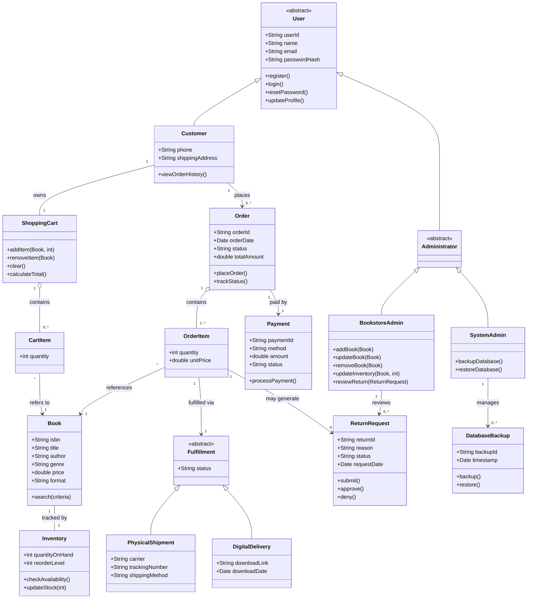

[bookstore-class-diagram.md](https://github.com/user-attachments/files/32423643/bookstore-class-diagram.md)
# Bookstore System – UML Class Diagram

```mermaid
classDiagram
    class User {
        <<abstract>>
        +String userId
        +String name
        +String email
        +String passwordHash
        +register()
        +login()
        +resetPassword()
        +updateProfile()
    }
    class Customer {
        +String phone
        +String shippingAddress
        +viewOrderHistory()
    }
    class Administrator {
        <<abstract>>
    }
    class BookstoreAdmin {
        +addBook(Book)
        +updateBook(Book)
        +removeBook(Book)
        +updateInventory(Book, int)
        +reviewReturn(ReturnRequest)
    }
    class SystemAdmin {
        +backupDatabase()
        +restoreDatabase()
    }
    User <|-- Customer
    User <|-- Administrator
    Administrator <|-- BookstoreAdmin
    Administrator <|-- SystemAdmin

    class Book {
        +String isbn
        +String title
        +String author
        +String genre
        +double price
        +String format
        +search(criteria)
    }
    class Inventory {
        +int quantityOnHand
        +int reorderLevel
        +checkAvailability()
        +updateStock(int)
    }
    Book "1" -- "1" Inventory : tracked by

    class ShoppingCart {
        +addItem(Book, int)
        +removeItem(Book)
        +clear()
        +calculateTotal()
    }
    class CartItem {
        +int quantity
    }
    Customer "1" -- "1" ShoppingCart : owns
    ShoppingCart "1" o-- "0..*" CartItem : contains
    CartItem "*" --> "1" Book : refers to

    class Order {
        +String orderId
        +Date orderDate
        +String status
        +double totalAmount
        +placeOrder()
        +trackStatus()
    }
    class OrderItem {
        +int quantity
        +double unitPrice
    }
    Customer "1" --> "0..*" Order : places
    Order "1" o-- "1..*" OrderItem : contains
    OrderItem "*" --> "1" Book : references

    class Fulfillment {
        <<abstract>>
        +String status
    }
    class PhysicalShipment {
        +String carrier
        +String trackingNumber
        +String shippingMethod
    }
    class DigitalDelivery {
        +String downloadLink
        +Date downloadDate
    }
    Fulfillment <|-- PhysicalShipment
    Fulfillment <|-- DigitalDelivery
    OrderItem "1" --> "1" Fulfillment : fulfilled via

    class Payment {
        +String paymentId
        +String method
        +double amount
        +String status
        +processPayment()
    }
    Order "1" --> "1" Payment : paid by

    class ReturnRequest {
        +String returnId
        +String reason
        +String status
        +Date requestDate
        +submit()
        +approve()
        +deny()
    }
    OrderItem "1" --> "0..1" ReturnRequest : may generate
    BookstoreAdmin "1" --> "0..*" ReturnRequest : reviews

    class DatabaseBackup {
        +String backupId
        +Date timestamp
        +backup()
        +restore()
    }
    SystemAdmin "1" --> "0..*" DatabaseBackup : manages
```
